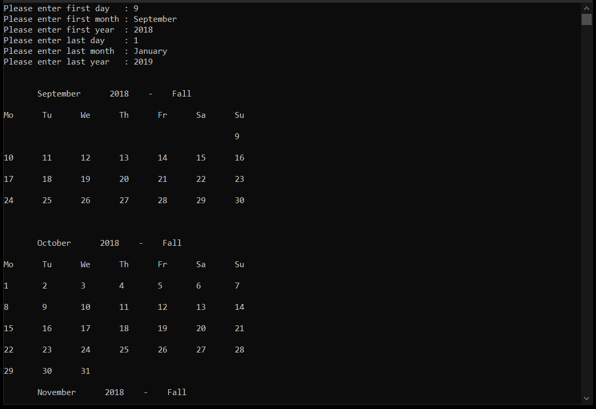

# Calendar
- C# program that takes two dates (day, month, and year) separately from the user and prints the calendar between these dates using nested loops.
- The aim of the project is to create calendar between 2 input dates without using Date related commands, data types and libraries such as DateTime, AddDays(), DayofWeek(), etc.
- To determine the day of the week, Schwerdtfeger's method used.
- For more information : https://wiki2.org/en/Determination_of_the_day_of_the_week
- Sample Input & Output :

